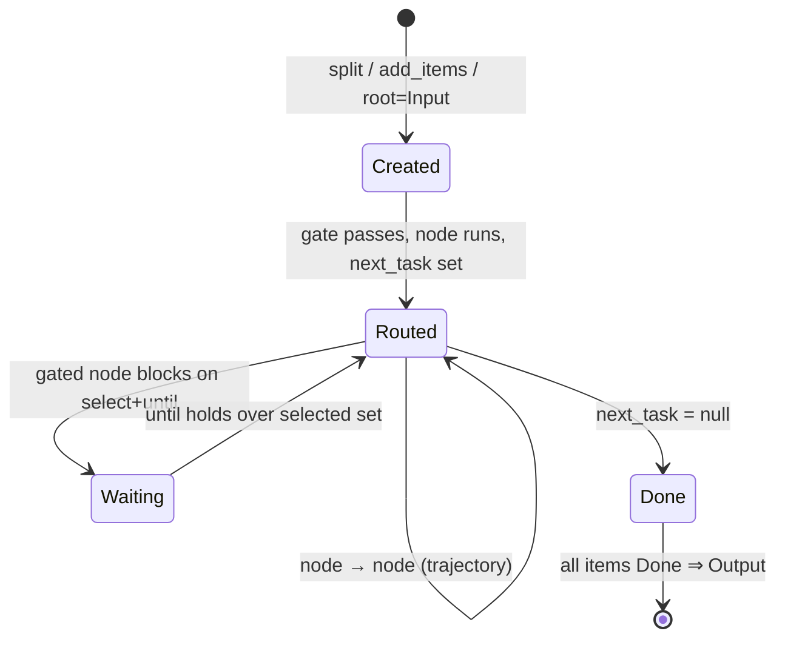
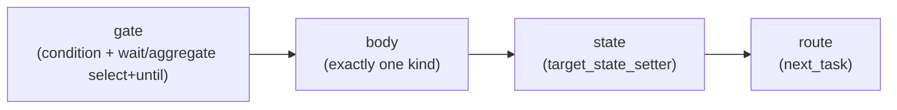
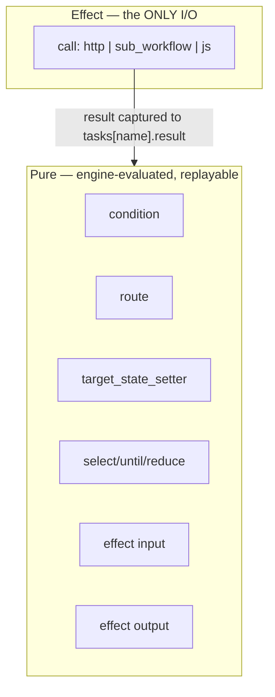
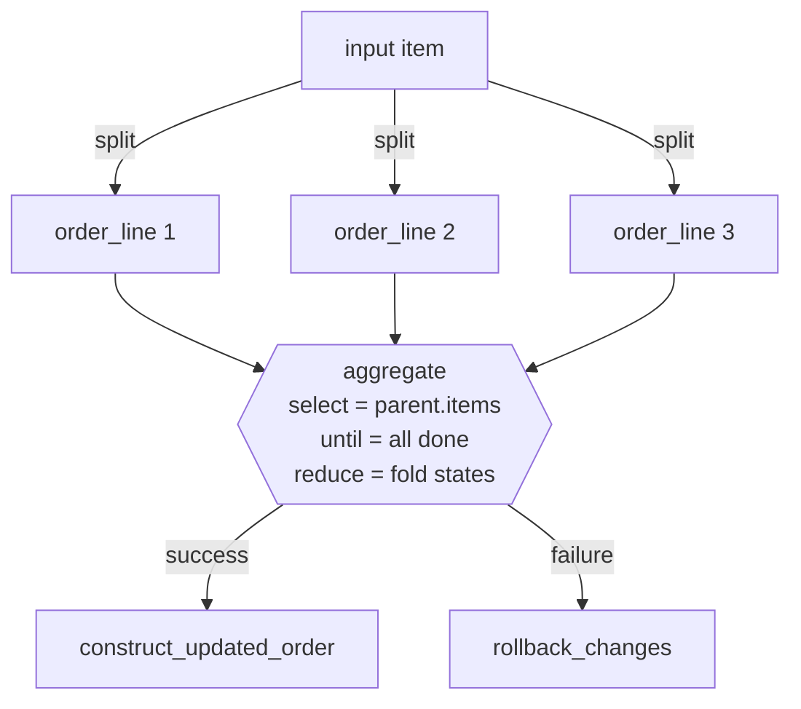
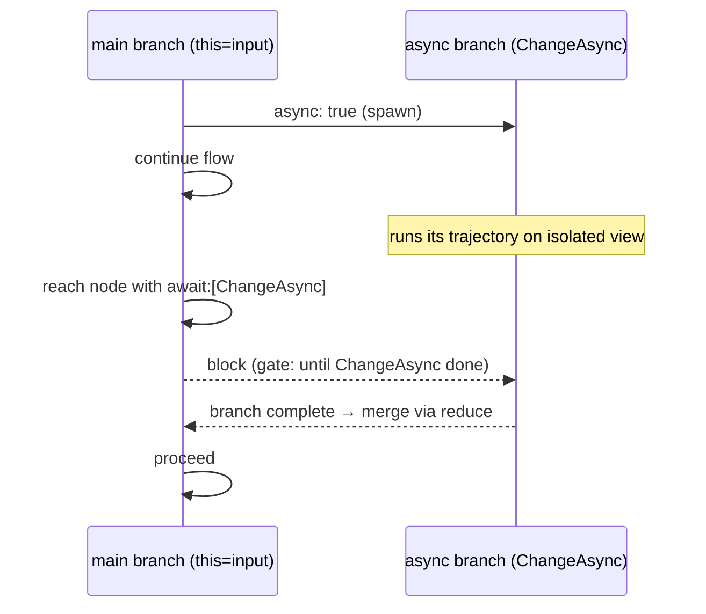
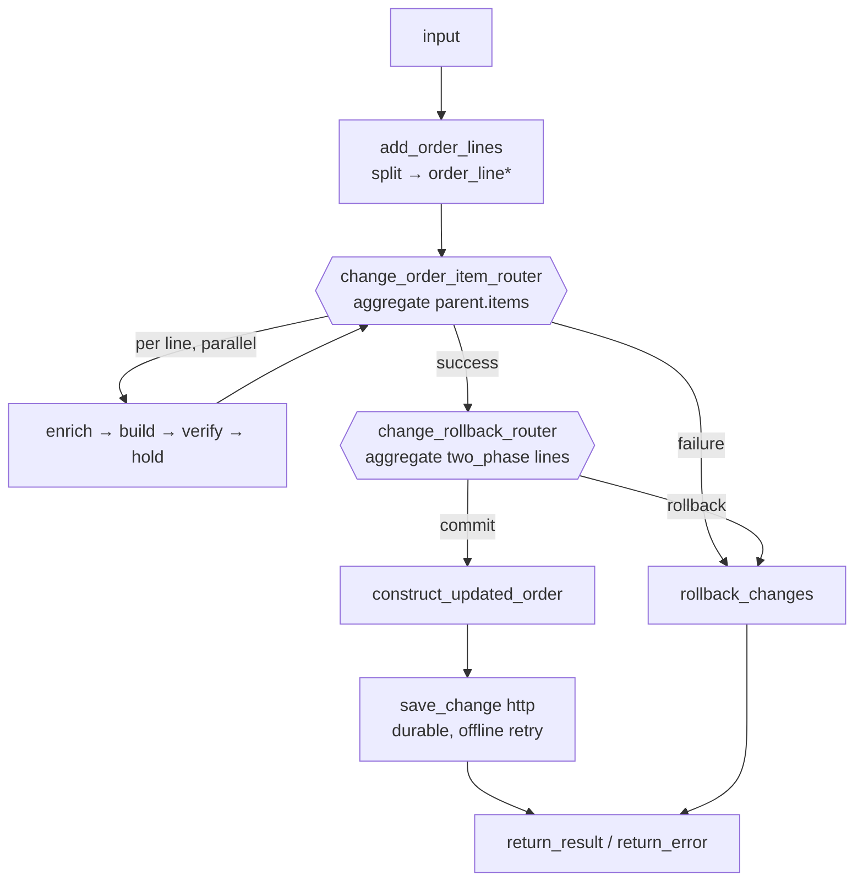

# AFlow — Workflow / Rule Engine Specification

> Status: **Draft for review** · Date: 2026-07-23
>
> This document specifies the AFlow workflow engine, the JSON representation of a
> workflow, the human-authored **hjson** form, and the **TypeScript DSL** that
> produces it. 

---

## Table of contents

1. [Goals & non-goals](#1-goals--non-goals)
2. [Core concepts](#2-core-concepts)
3. [The Item model](#3-the-item-model)
4. [The node model — one primitive, four phases](#4-the-node-model--one-primitive-four-phases)
5. [Expressions vs. effects (the determinism boundary)](#5-expressions-vs-effects-the-determinism-boundary)
6. [Body kinds](#6-body-kinds)
7. [Aggregation, waiting & joins](#7-aggregation-waiting--joins)
8. [Async transitions & determinism](#8-async-transitions--determinism)
9. [Effect tasks, external code & bundles](#9-effect-tasks-external-code--bundles)
10. [Types & the `definitions` block](#10-types--the-definitions-block)
11. [Retry mechanism](#11-retry-mechanism)
12. [Execution algorithm](#12-execution-algorithm)
13. [The workflow JSON document](#13-the-workflow-json-document)
14. [hjson authoring form](#14-hjson-authoring-form)
15. [The TypeScript DSL](#15-the-typescript-dsl)
16. [JSON Schema (normative skeleton)](#16-json-schema-normative-skeleton)
17. [Worked example](#17-worked-example)
18. [Glossary](#18-glossary)

---

## 1. Goals & non-goals

### Goals

- **Deterministic guidance.** Given a workflow specification and an input, the
  engine drives the input to an `end` state by executing a sequence of tasks. The
  *outcome* (final item tree + result) is a pure function of the specification and
  the recorded effect results — independent of scheduling and timing (§8).
- **Items that split, spawn and merge.** An input "item" may be divided into
  several items along the way, and tasks may create new items. Independent items
  follow independent trajectories (their own task sequences), yet can be
  **aggregated** at join points using selector + wait conditions (§7).
- **Async transitions.** A transition (task start) may fire asynchronously; other
  tasks may wait on it (§8).
- **JavaScript everywhere authors expect code.** Pure expressions and effectful
  task bodies are written in JavaScript/TypeScript. Effect bodies may call external
  APIs using libraries **packed with the workflow** or resolved from an **external
  artifactory** (§9).
- **Three interchangeable representations** with a single semantics: canonical
  **JSON** (§13), hand-authored **hjson** (§14), and a typed **TS DSL** (§15).

### Deliverable artifacts

This specification is realised by four artifacts, each with a well-defined
interface:

1. **Workflow schema definition** — the JSON Schema (`aflow.schema.json`, §16) that
   defines and validates the JSON representation of any workflow.
2. **Workflow DSL definition** — the typed TypeScript DSL (§15) authors use to
   write workflows, with autocomplete and compile-time checks derived from the
   workflow's type `definitions` (§10).
3. **DSL → plan compiler / converter** — a tool that compiles a DSL workflow into
   the canonical **plan**: the schema-valid workflow JSON, and its 1:1 hjson form
   (§14). Round-trippable: `DSL → hjson → JSON`.
4. **Workflow evaluation engine** — the runtime that executes a workflow:
   - **input:** a workflow definition (conforming to the schema of artifact 1) plus
     an input request (conforming to the workflow's declared `input` type, §10);
   - **output:** a response conforming to the workflow's declared `result` type, or
     a declared error;
   - **behaviour:** drives the input item deterministically through the task graph
     to an end state per §12, with the guarantees of §8.

### Non-goals

- Not a general programming language. Expressions are pure and side-effect free
  (§5). Arbitrary I/O is confined to declared effect tasks.
- Not a UI/BPMN modeller. The graph is defined in code/JSON, not drawn.
- Distributed scheduling internals (queues, `offline` retry storage) are described
  at the contract level, not as an implementation.

---

## 2. Core concepts

The engine evaluates a **workflow specification** against **input data** and
produces a determined **result** by performing a sequence of **tasks** on parts of
the input.

| Concept | Meaning |
|---|---|
| **Item** | A part of the input (or data created during evaluation) with a unique `id`, a specific sequence of tasks to perform, `data`, working `objects`, and recorded task state. Items form a tree. |
| **Task / node** | A unit of work applied to an item. The workflow is a graph of nodes connected by routing. |
| **`this`** | The item a node currently operates on. Every expression is evaluated with `this` bound to that item, with `parent`, `items` (children) and `root` reachable. |
| **Trajectory** | The ordered sequence of nodes an item actually visits (its `next_task` chain). Independent items have independent trajectories. |
| **target_state** | The item's current disposition (e.g. `success`, `failure`) — the value routing and aggregation branch on. (Renamed from the PDF's `currentState`.) |
| **Workflow context** | The set of all items (including the root) for one request. `this` points at the "current" item; parallel execution makes isolated context copies (§8). |

The workflow specification expresses these flow-control concepts, all through the
single node primitive of §4:

- item **creation** (split / add),
- item **enrichment** (data & attributes),
- item **flow routing** (`next_task`),
- item **grouping / ordering** (selectors),
- item **synchronization** (wait / aggregate / join).

---

## 3. The Item model

An item is the main data component flowing through the workflow. There is exactly
one item structure (following the PDF "Draft"):

```jsonc
{
  "id": "123456",
  "type": "order_line",          // item type; selects which nodes apply
  "parent": "…",                  // id of the item this was split/created from; null for root
  "items": [ /* child items */ ], // items created/split from this one

  "data":    { /* typed payload; for the root this is the workflow input */ },
  "objects": { /* typed working state, grown by `enrich` and effect `output` */ },

  "tasks": {                      // recorded state, one entry per node this item visited
    "verify_change": {
      "id": "1234567",
      "status": "success",        // success | failure | pending | error
      "started": "2020-12-03T10:15:30+01:00",
      "updated": "2020-12-03T10:15:30+02:00",
      "result": { /* effect/output data */ },
      "error":  { "code": 7001, "category": "TECHNICAL", "message": "…",
                  "data": { /* … */ }, "next_retry": "…", "retry_type": "offline" }
    }
  },

  "next_task": "make_change",   // routing target; null ⇒ this item's branch is complete
  "target_state": "success",      // author-defined disposition
  "logging_context": { "order_id": "123456" },
  "additional_properties": { /* free-form */ }
}
```

**Rules**

- The **root** item is created automatically; its `data` is the workflow input, its
  `next_task` is the default `Input` node (§12).
- Every non-root item has a `parent`: **the item it was split from or created by**
  (root or any descendant).
- `next_task === null` marks the end of an item's branch. When *all* items are
  `null`, evaluation terminates and the default `Output` node maps the root's
  `target_state` to `result` or `error`.
- `tasks[name]` accumulates one record per visited node. Effect results and errors
  are captured here so replay/retry/aggregation read recorded values, never live
  I/O.

Item lifecycle:



---

## 4. The node model — one primitive, four phases

There is **one node primitive** ("task"). A node binds to an **item type** (the
`this` it applies to) and runs up to four ordered **phases**; any phase may be
omitted:



| Phase | Purpose | Purity |
|---|---|---|
| **gate** | `condition` — may this node fire on `this`? Optional `select` + `until` block the node until a set of items satisfies a condition (§7). | pure |
| **body** | Exactly one *kind* (§6): `enrich`, `route`, `split`, `aggregate`, `call`, or `return`. | pure, except `call` |
| **state** | `target_state_setter` computes the item's `target_state`. | pure |
| **route** | Computes `next_task` from `target_state`/expression via `switch`/`cases` or a direct name. | pure |

A node's common (kind-independent) fields:

```jsonc
{
  "name": "verify_change",
  "item": "order_line",        // which item type this node applies to (the `this` binding)
  "condition": { "$expr": "true" },        // gate predicate (default: always)
  "await":  { /* select + until */ },        // optional synchronization (§7)
  "async":  false,                            // fire this node's branch asynchronously (§8)
  "durable": false,                           // persist before running (crash-safe)
  "idempotent": false,
  "timeout": 5000,
  "retry": { /* §11 */ },
  "<bodyKind>": { /* exactly one of §6 */ },
  "target_state_setter": { "$expr": "…" },
  "route": { /* name | switch/cases | expression */ }
}
```

> **`$expr`** marks a **pure JavaScript expression** evaluated against `this` (§5).
> In hjson/DSL it is written as real JS; in JSON it is a string.

---

## 5. Expressions vs. effects (the determinism boundary)

AFlow embeds two — and only two — flavours of code:

### Pure expressions (`$expr`)

Used for `condition`, `route`, `target_state_setter`, `select`, `until`, `reduce`,
effect `input`, and effect `output` transforms. They:

- are evaluated by the engine freely, at any time, possibly repeatedly (scheduling,
  aggregation, replay);
- may read `this` and the reachable tree (`parent`, `items`, `root`, `tasks`);
- may **not** perform I/O, mutate global state, read the clock/RNG, or depend on
  arrival order. They are deterministic functions of the item tree.

The expression language is JavaScript restricted to pure evaluation : collection filtering/among items —
`items.filter(i => i.type==='order_line')`, quorum —
`set.every(i => i.next_task===null)`, lookups — `parent.objects.order`.

### Effects (declared tasks only)

All I/O (HTTP, sub-workflow, inline JS calling external APIs) happens **only**
inside a `call` body (§6, §9). The effect's **result is captured** into
`this.tasks[name].result`. Downstream expressions read the recorded result, never
the live call. This is what makes determinism-of-outcome (§8) and retry/replay
(§11) sound.

[//]: # (diagram: left:50)


---

## 6. Body kinds

Exactly one body kind per node.

| Kind | Pure? | Purpose |
|---|---|---|
| `enrich` | pure | Write `this.objects` / `this.data` / `logging_context`. |
| `route` | pure | Routing-only node (no body work; just sets `next_task`). |
| `split` (`add_items`) | pure | Create child items from a selector; optionally route + run them (parallel). |
| `aggregate` (`join`) | pure | General wait-then-reduce over a selected item set (§7). |
| `call` | **effect** | Invoke `http` / `sub_workflow` / `js`; capture result. |
| `return` | terminal | Emit workflow `result` or `error` and end the branch. |

### 6.1 `enrich`

```jsonc
{ "name": "enrich_order_line", "item": "order_line",
  "enrich": { "$do": "objects.order_item = parent.objects.order.order_items.find(oi => oi.id === data.order_item_id)" },
  "route": "build_change_target" }
```

`$do` is a pure statement block that assigns into `this` (`objects`, `data`,
`logging_context`, `optional`, etc.). It performs no I/O.

### 6.2 `route` (router)

```jsonc
{ "name": "verify_change_router", "item": "order_line",
  "route": { "switch": { "$expr": "objects.change_order_process.mode" },
             "cases": { "one_mode": "do_change", "other_mode": null } } }
```

### 6.3 `split` / `add_items`

Creates children of `this`. `selector` returns an array; each element becomes a
child item's `data`. `parallel` runs the produced items concurrently (§8).

```jsonc
{ "name": "add_order_lines", "item": "input",
  "split": {
    "itemType": "order_line",
    "selector": { "$expr": "data.order_item_ids ? data.order_item_ids.map(id => ({order_item_id:id})) : objects.order.order_items.map(oi => ({order_item_id: oi.id}))" },
    "route": "enrich_order_line",
    "parallel": true
  },
  "route": "change_order_item_router" }
```

### 6.4 `aggregate` / `join`

See §7.

### 6.5 `call`

See §9.

### 6.6 `return`

```jsonc
{ "name": "return_result", "item": "input",
  "return": { "result": { "$expr": "objects.change_response" } } }
```

```jsonc
{ "name": "return_error", "item": "input",
  "return": { "error": { "$expr": "({ code:500, category:'TECHNICAL', message:'Something very bad happened', data:{ causes: objects.error_causes } })" } } }
```

---

## 7. Aggregation, waiting & joins

Aggregation is **not** a special mechanism — it is the general form of a gated node.
A node may declare a **selector** (the set to wait on), an **`until`** fire
condition, and a **`reduce`** that folds the set into `this`. All three are pure
expressions evaluated with a chosen `this`.

```jsonc
{ "name": "change_rollback_router", "item": "input",
  "aggregate": {
    "select": { "$expr": "items.filter(i => i.objects?.change_order_process?.transaction_mode === 'two_phase')" },
    "until":  { "$expr": "set.every(i => i.next_task === null)" },
    "reduce": { "$do": "objects.all_committed = set.every(i => i.target_state === 'success')" }
  },
  "target_state_setter": { "$expr": "items.find(i => i.target_state==='failure' && !i.optional) ? 'failure' : 'success'" },
  "route": { "cases": { "success": "construct_updated_order", "failure": "rollback_changes" } } }
```

### The three shapes are one mechanism

- **A — parent barrier (the everyday case).** `select` reads `parent`'s children.
  Because computing a node's input or checking a condition already reads *across*
  items, most joins are simply "wait until my children reach a routing point, then
  read them."
- **B — await this item's own prior work.** `select` = `this` itself; `until`
  reads `this.tasks` or this item's async branches. Sugar: `await: ["ChangeAsync"]`
  (§8) is a B-gate on named branches.
- **C — general.** `this` is any item; `select` an arbitrary item set.



### Determinism constraints (normative)

- `until` MUST be **monotonic**: once true for a set it stays true as members
  finish (e.g. `every(done)`, `count(done) >= n`). No "first to arrive" logic.
- `reduce` MUST be **commutative & associative** over the selected set — the result
  cannot depend on member order.
- A gated node **blocks** (item state `Waiting`) until `until` holds, then runs
  `reduce` → `state` → `route`. Blocking is on data, not wall-clock.

---

## 8. Async transitions & determinism

### Async

- `async: true` on a node spawns a **branch** for its item: the flow continues past
  this node without waiting. The branch runs until its `next_task === null`.
- `parallel: true` on a `split` spawns one branch per produced child.
- Each branch executes on an **isolated write view** of the item tree. `this`
  inside a branch points at that branch's item; the main context's `this` is
  unchanged.



### Determinism guarantee (chosen model: outcome-deterministic)

- **Final item tree + result are scheduling-independent.** Async/parallel tasks may
  run in any order or overlap; the determined outcome is identical.
- This is enforced by three rules:
  1. **Isolated writes.** Concurrent branches merge into shared state **only**
     through a join's `reduce` (§7). Two live branches writing the same `objects`
     path is a **validation error** (detected statically where possible, at runtime
     otherwise).
  2. **Monotone `until` / commutative `reduce`** (§7).
  3. **Captured effects.** Effect results are recorded (§5); replay uses recorded
     values.
- **Timing / side-effect order is NOT guaranteed** (logs may interleave). Authors
  who need ordered side effects must serialize them with an explicit trajectory.

---

## 9. Effect tasks, external code & bundles

A `call` body is the only place I/O happens. It selects one **provider**.

### Common shape

```jsonc
{ "name": "save_change", "item": "input",
  "durable": true, "idempotent": true, "timeout": 4500,
  "retry": { "inline": { "max_count": 0 }, "offline": { "max_count": 10, "interval": "5m" } },
  "call": {
    "provider": "http",
    "input":  { "$expr": "objects.save_request" },
    "request": {
      "method":  "POST",
      "url":     { "$expr": "`${parameters['persistence.base-url']}/orders/${data.order_id}`" },
      "headers": { "$expr": "({ 'content-type': 'application/json' })" },
      "body":    { "$expr": "objects.save_request" }
    },
    "output": { "resultType": "SaveResponse", "errorType": "Error",
                "enrich": { "$do": "objects.save_status = result.status" } }
  },
  "route": "return_result" }
```

### Providers

| provider | description |
|---|---|
| `http` | Declarative HTTP request; retry on 5xx / IO per §11. |
| `sub_workflow` | Invoke another workflow by `name` with computed `input`; its `result`/`error` is captured; offline retries bubble to the root (§11). |
| `js` | **Inline JavaScript** — arbitrary code, may call external APIs. `input` expression feeds it; return value captured as the task result. |

### Inline JS + libraries

```jsonc
{ "name": "score_fraud", "item": "input", "timeout": 30000,
  "call": {
    "provider": "js",
    "implementation": {                     // packaged with the workflow…
      "bundle_name": "fraud-utils",
      "bundle_version": "1.4.0",
      "entry": "com.example.FraudScorer"
    },
    "registry": { "url": "https://artifactory.example.com/npm", "ref": "@org/fraud-utils@1.4.0" }, // …or external artifactory
    "input":  { "$expr": "({ order: objects.order, payments: objects.payments })" },
    "script": "async (input, lib) => { return await lib.score(input); }",
    "output": { "enrich": { "$do": "objects.fraud = result" } }
  },
  "route": "…" }
```

- `implementation.bundle_*` resolves from libraries **packed alongside the
  workflow**; `registry` resolves from an **external artifactory**. Exactly one
  resolution source is required when `script` references external code.
- The `script` runs sandboxed with two arguments: the computed `input` and the
  resolved library namespace `lib`. Its return value (or thrown error) is captured
  like any effect result/error and is subject to retry.
- Because the result is captured, the surrounding **expressions stay pure** and the
  determinism model (§8) holds even though the call itself is effectful.

---

## 10. Types & the `definitions` block

Types are first-class and **travel with the workflow**, exactly as in
`generated.json`.

- **`definitions{}`** — JSON-Schema definitions of every message type
  (`ChangeOrderRequest`, `ChangeOrderResponse`, `Order`, …), typically generated
  from your domain type definitions. `input` and `result` are `$ref`s into it:

  ```jsonc
  "definitions": {
    "input":  { "$ref": "#/definitions/com.example.ChangeOrderRequest" },
    "result": { "$ref": "#/definitions/com.example.ChangeOrderResponse" },
    "com.example.Order": { "type": "object", "properties": { /* … */ } }
  }
  ```

- **Item type declarations** bind each item type's `data`, `objects` and `parent`
  types by `$ref`:

  ```jsonc
  "items": {
    "input":      { "data": { "$ref": "#/definitions/input" }, "objects": { "$ref": "#/definitions/InputObjects" }, "parent": null },
    "order_line": { "data": { "$ref": "#/definitions/OrderOrderData" }, "objects": { "$ref": "#/definitions/OrderObjects" }, "parent": "input" }
  }
  ```

- **TS DSL projection.** A codegen step turns `definitions` into `.d.ts`. The DSL
  presents each item type as `TypedItem<Data, Objects, Parent>`, so inside a node
  bound to `order_line`, `this.data.order_item_id` and
  `this.parent.objects.order` autocomplete and type-check. This is the mechanism
  behind the requested autocomplete/highlighting.

The engine validates `data`/`objects`/`input`/`result` against the referenced
schemas.

---

## 11. Retry mechanism

Carried over from the reference engine; applies to effect tasks (§9).

- Errors returned by effect tasks carry `retry_type` and `next_retry`. Task
  `retry` config has `inline` (fixed `interval`, `max_count`) and `offline`
  (scheduled, exponentially growing `interval` up to `max_interval`, `max_count`).
- Resolution: a requested retry is reduced to a basic type using the task's config
  and prior errors. `inline_then_offline` tries `inline` first, then `offline`.
  `max_count: 0` disables that tier.
- **Output transformation.** A pure `output` expression may turn even a successful
  response into an error (to trigger a retry) — evaluated as part of output
  transform, before enrich.
- **Sub-workflow retries.** Inline retries stay inside the sub-workflow; offline
  retries return `retry_type=offline` + `next_retry` to the parent, since only the
  root workflow schedules offline retries. The parent re-resolves using the
  sub-workflow task's own `retry` config, so total offline retries are controllable
  from the parent.
- `catch_offline_retry_error: true` stores an offline-retry error in context and
  returns it at the end of flow instead of interrupting execution.

---

## 12. Execution algorithm

```
1. Create root item; root.data = workflow input; root.next_task = "Input".
2. Loop until every item has next_task === null:
     a. Runnable set = items whose next_task node's `condition` passes AND,
        if the node has a gate `select`/`until`, whose `until` holds over `select`.
     b. Pick runnable items (any order — outcome is scheduling-independent):
          - run body (enrich | route | split | aggregate | call | return)
          - capture effect result/error into tasks[name]
          - run target_state_setter → item.target_state
          - run route → item.next_task (null ends the branch)
     c. `async` nodes / `parallel` splits spawn isolated branches (§8).
     d. Gated nodes with unmet `until` stay Waiting (do not busy-loop).
3. Default "Output" node maps root.target_state → result | error via the terminal
   `return` nodes.
```

Default nodes:

- **`Input`** — creates/fills the root item's `data` from the workflow input; may
  be overloaded to add transformation/filtering.
- **`Output`** — checks `target_state`; on success yields `result`, otherwise
  `error`.

---

## 13. The workflow JSON document

Top-level shape (canonical machine form; equivalent of `generated.json`):

```jsonc
{
  "client_id": "someclient",
  "name": "change_order",
  "version": "<auto>",

  "definitions": { /* §10 — message types; input/result $refs */ },
  "items":       { /* §10 — item type declarations */ },

  "config": {
    "json_descriptor": { "name": "business-domains-schema" },
    "bundles": [ { "name": "fraud-utils", "version": "1.1.1" } ],
    "defaults": {
      "item": {
        "objects": { "errors": [], "tech_errors": [] },
        "target_state": "success",
        "allowed_target_states": ["success", "failure"],
        "default_target_state_setter": { "$expr": "task_state.error ? 'failure' : (target_state==='success' ? (parent?.target_state ?? 'success') : target_state)" }
      },
      "task": {
        "route": { "switch": { "$expr": "target_state" } },
        "default_error_handler": { "item": "common", "$do": "objects.tech_errors.push({ detail: error.message, type: 'https://…/order/common/internal' })" }
      }
    }
  },

  "tasks": [ /* array of nodes (§4) — the graph, connected by `route` */ ]
}
```

Notes:

- `tasks` is an **ordered array of nodes**; edges are implicit in each node's
  `route`. Node `name` is the routing key (`next_task`).
- `config.defaults` supplies default item attributes and default task
  route/error-handling (mirrors the reference `default_properties`).
- `config.bundles` lists libraries packed with the workflow (§9).

---

## 14. hjson authoring form

The hand-authored form is [hjson](https://hjson.github.io/): JSON with comments,
unquoted keys, multiline strings, and trailing-comma tolerance. It maps **1:1** to
the JSON of §13 — `$expr`/`$do`/`script` bodies become readable multiline JS.

```hjson
{
  client_id: someclient
  name: change_order

  tasks:
  [
    {
      name: add_order_lines
      item: input
      // split the order into one child item per order line
      split:
      {
        itemType: order_line
        selector:
          '''
          data.order_item_ids
            ? data.order_item_ids.map(id => ({ order_item_id: id }))
            : objects.order.order_items.map(oi => ({ order_item_id: oi.id }))
          '''
        route: enrich_order_line
        parallel: true
      }
      route: change_order_item_router
    }

    {
      name: change_rollback_router
      item: input
      // wait for all 'two_phase' order lines, then decide commit vs rollback
      aggregate:
      {
        select: "items.filter(i => i.objects?.change_order_process?.transaction_mode === 'two_phase')"
        until:  "set.every(i => i.next_task === null)"
      }
      target_state_setter: "items.find(i => i.target_state==='failure' && !i.optional) ? 'failure' : 'success'"
      route: { cases: { success: construct_updated_order, failure: rollback_changes } }
    }
  ]
}
```

A conforming toolchain provides `hjson → json` and `json → hjson` converters; the
JSON is what the engine loads and what the JSON Schema (§16) validates.

---

## 15. The TypeScript DSL

The DSL is a typed builder that emits hjson/JSON. It is generated from (or authored
alongside) the type `definitions` (§10), giving autocomplete, syntax highlighting
and compile-time checks. Pure expressions are written as **typed arrow functions**
that the DSL serializes to `$expr`/`$do` strings; effect bodies are declared with
builder methods.

```typescript
import { workflow, InputItem, ChildItem } from "@aflow/dsl";
import type { ChangeOrderRequest, ChangeOrderResponse, OrderLineData, OrderLineObjects } from "./generated.types";

const wf = workflow<ChangeOrderRequest, ChangeOrderResponse>({
  clientId: "someclient",
  name: "change_order",
});

// Item types: TypedItem<Data, Objects, Parent>
const Input     = wf.item("input", InputItem<ChangeOrderRequest>());
const OrderLine = wf.item("order_line", ChildItem<OrderLineData, OrderLineObjects, typeof Input>());

wf.task("add_order_lines", Input, t => {
  t.split(OrderLine, {
    // `this` is fully typed → autocomplete on data/objects
    selector: (self) =>
      self.data.orderItemIds?.length
        ? self.data.orderItemIds.map(id => ({ orderItemId: id }))
        : self.objects.order.orderItems.map(oi => ({ orderItemId: oi.id })),
    route: "enrich_order_line",
    parallel: true,
  });
  t.route("change_order_item_router");
});

wf.task("change_rollback_router", Input, t => {
  t.aggregate({
    select: (self) => self.items.filter(i => i.objects?.changeOrderProcess?.transactionMode === "two_phase"),
    until:  (set)  => set.every(i => i.nextTask === null),
  });
  t.targetState((self) =>
    self.items.find(i => i.targetState === "failure" && !i.optional) ? "failure" : "success");
  t.route({ success: "construct_updated_order", failure: "rollback_changes" });
});

wf.task("save_change", Input, t => {
  t.durable().idempotent()
   .retry({ inline: { maxCount: 0 }, offline: { maxCount: 10, interval: "5m" } });
  t.call.http({
    method: "POST",
    url:    (self) => `${self.params["persistence.base-url"]}/orders/${self.data.orderId}`,
    body:   (self) => self.objects.saveRequest,
    output: (self, result) => { self.objects.saveStatus = result.status; },
  });
  t.route("return_result");
});

wf.call.js("score_fraud", Input, {          // effect: inline JS + bundled/artifactory library
  bundle: { name: "fraud-utils", version: "1.4.0", entry: "com.example.FraudScorer" },
  input:  (self) => ({ order: self.objects.order }),
  script: async (input, lib) => await lib.score(input),
  output: (self, result) => { self.objects.fraud = result; },
});

export default wf.build(); // → hjson / JSON
```

DSL guarantees:

- **Purity by construction.** `selector`/`until`/`route`/`targetState` callbacks are
  serialized to `$expr`; the DSL forbids `await`/imports inside them (lint rule),
  so authors cannot accidentally do I/O in an expression.
- **Effect isolation.** I/O lives in `t.call.*` / `wf.call.js` only.
- **Typed tree navigation.** `self.parent`, `self.items`, `self.root` are typed from
  the item declarations.

---

## 16. JSON Schema (normative skeleton)

The full schema is delivered as `aflow.schema.json`. Skeleton:

```jsonc
{
  "$schema": "https://json-schema.org/draft/2020-12/schema",
  "$id": "https://aflow.dev/schemas/aflow.schema.json",
  "title": "AFlow workflow",
  "type": "object",
  "required": ["client_id", "name", "definitions", "items", "tasks"],
  "properties": {
    "client_id": { "type": "string" },
    "name": { "type": "string" },
    "version": { "type": "string" },

    "definitions": { "type": "object" },        // JSON-Schema message types; input/result $refs

    "items": {                                   // item type declarations
      "type": "object",
      "additionalProperties": {
        "type": "object",
        "properties": {
          "data":    { "$ref": "#/$defs/typeRef" },
          "objects": { "$ref": "#/$defs/typeRef" },
          "parent":  { "type": ["string", "null"] }
        }
      }
    },

    "config": { "type": "object" },

    "tasks": { "type": "array", "items": { "$ref": "#/$defs/node" } }
  },

  "$defs": {
    "expr": {                                    // pure expression / statement / script
      "oneOf": [
        { "type": "string" },
        { "type": "object", "properties": { "$expr": { "type": "string" } }, "required": ["$expr"] },
        { "type": "object", "properties": { "$do":   { "type": "string" } }, "required": ["$do"] }
      ]
    },
    "typeRef": { "type": ["object", "null"], "properties": { "$ref": { "type": "string" } } },

    "route": {
      "oneOf": [
        { "type": ["string", "null"] },                                   // direct next_task
        { "type": "object", "required": ["cases"],
          "properties": { "switch": { "$ref": "#/$defs/expr" },
                          "cases": { "type": "object", "additionalProperties": { "type": ["string", "null"] } } } }
      ]
    },

    "gate": {                                    // §7 wait/aggregate
      "type": "object",
      "properties": {
        "select": { "$ref": "#/$defs/expr" },
        "until":  { "$ref": "#/$defs/expr" },
        "reduce": { "$ref": "#/$defs/expr" }
      }
    },

    "retry": {
      "type": "object",
      "properties": {
        "inline":  { "type": "object", "properties": { "max_count": { "type": "integer" }, "interval": { "type": "string" } } },
        "offline": { "type": "object", "properties": { "max_count": { "type": "integer" }, "interval": { "type": "string" }, "max_interval": { "type": "string" } } }
      }
    },

    "node": {
      "type": "object",
      "required": ["name", "item"],
      "properties": {
        "name": { "type": "string" },
        "item": { "type": "string" },
        "condition": { "$ref": "#/$defs/expr" },
        "await":     { "$ref": "#/$defs/gate" },
        "async":     { "type": "boolean" },
        "durable":   { "type": "boolean" },
        "idempotent":{ "type": "boolean" },
        "timeout":   { "type": "integer" },
        "retry":     { "$ref": "#/$defs/retry" },
        "target_state_setter": { "$ref": "#/$defs/expr" },
        "route":     { "$ref": "#/$defs/route" },

        // exactly one body kind:
        "enrich":    { "type": "object", "properties": { "$do": { "type": "string" } } },
        "split":     { "type": "object", "required": ["itemType", "selector"],
                       "properties": { "itemType": { "type": "string" }, "selector": { "$ref": "#/$defs/expr" },
                                       "route": { "type": ["string", "null"] }, "parallel": { "type": "boolean" } } },
        "aggregate": { "$ref": "#/$defs/gate" },
        "call":      { "$ref": "#/$defs/call" },
        "return":    { "type": "object",
                       "properties": { "result": { "$ref": "#/$defs/expr" }, "error": { "$ref": "#/$defs/expr" } } }
      },
      // A node carries AT MOST ONE body kind (enrich|split|aggregate|call|return).
      // A routing-only node omits the body entirely and carries just `route`.
      "allOf": [
        { "not": { "anyOf": [
          { "required": ["enrich", "split"] },   { "required": ["enrich", "aggregate"] },
          { "required": ["enrich", "call"] },    { "required": ["enrich", "return"] },
          { "required": ["split", "aggregate"] },{ "required": ["split", "call"] },
          { "required": ["split", "return"] },   { "required": ["aggregate", "call"] },
          { "required": ["aggregate", "return"] },{ "required": ["call", "return"] }
        ] } }
      ]
    },

    "call": {
      "type": "object",
      "required": ["provider"],
      "properties": {
        "provider": { "enum": ["http", "sub_workflow", "js"] },
        "input":    { "$ref": "#/$defs/expr" },
        "output":   { "type": "object",
                      "properties": { "resultType": { "type": "string" }, "errorType": { "type": "string" },
                                      "enrich": { "$ref": "#/$defs/expr" } } },
        "request":  { "type": "object" },                       // http
        "name":     { "type": "string" },                       // sub_workflow
        "script":   { "type": "string" },                       // js
        "implementation": { "type": "object",
                            "properties": { "bundle_name": { "type": "string" }, "bundle_version": { "type": "string" }, "entry": { "type": "string" } } },
        "registry": { "type": "object",
                      "properties": { "url": { "type": "string" }, "ref": { "type": "string" } } }
      }
    }
  }
}
```

---

## 17. Worked example

A trimmed slice of the `change_order` reference workflow in all three forms,
exercising split → parallel order-lines → change/rollback join → save.

### Flow graph



### JSON (canonical)

```jsonc
{
  "client_id": "someclient",
  "name": "change_order",
  "definitions": {
    "input":  { "$ref": "#/definitions/ChangeOrderRequest" },
    "result": { "$ref": "#/definitions/ChangeOrderResponse" }
    /* … message types … */
  },
  "items": {
    "input":      { "data": { "$ref": "#/definitions/input" }, "objects": { "$ref": "#/definitions/InputObjects" }, "parent": null },
    "order_line": { "data": { "$ref": "#/definitions/OrderLineData" }, "objects": { "$ref": "#/definitions/OrderLineObjects" }, "parent": "input" }
  },
  "config": {
    "defaults": { "item": { "target_state": "success", "allowed_target_states": ["success", "failure"] } }
  },
  "tasks": [
    { "name": "add_order_lines", "item": "input",
      "split": { "itemType": "order_line",
                 "selector": { "$expr": "objects.order.order_items.map(oi => ({ order_item_id: oi.id }))" },
                 "route": "enrich_order_line", "parallel": true },
      "route": "change_order_item_router" },

    { "name": "change_order_item_router", "item": "input",
      "aggregate": { "select": { "$expr": "items.filter(i => i.type==='order_line')" },
                     "until":  { "$expr": "set.every(i => i.next_task === null)" } },
      "target_state_setter": { "$expr": "items.find(i => i.target_state==='failure' && !i.optional) ? 'failure' : 'success'" },
      "route": { "cases": { "success": "change_rollback_router", "failure": "rollback_changes" } } },

    { "name": "save_change", "item": "input", "durable": true, "idempotent": true, "timeout": 4500,
      "retry": { "inline": { "max_count": 0 }, "offline": { "max_count": 10, "interval": "5m" } },
      "call": { "provider": "http",
                "input": { "$expr": "objects.save_request" },
                "request": { "method": "POST",
                             "url": { "$expr": "`${parameters['persistence.base-url']}/orders/${data.order_id}`" },
                             "body": { "$expr": "objects.save_request" } },
                "output": { "resultType": "SaveResponse", "errorType": "Error" } },
      "route": "return_result" }
  ]
}
```

### hjson & DSL

See §14 and §15 for the same nodes in hjson and TypeScript. The three forms are
interchangeable; JSON is what the engine loads and the schema (§16) validates.

---

## 18. Glossary

| Term | Definition |
|---|---|
| **Item** | A uniquely-identified part of the input (or created during evaluation) that flows through the workflow carrying `data`, `objects`, and task state. |
| **`this`** | The item a node operates on; root of expression evaluation. |
| **Node / task** | A graph vertex applying one body kind to an item type, in four phases (gate/body/state/route). |
| **Trajectory** | The `next_task` chain an item actually visits. |
| **target_state** | The item's disposition that routing/aggregation branch on. |
| **Gate** | A node's fire condition, possibly a wait over a selected item set. |
| **Aggregate / join** | The general `select` + `until` + `reduce` over items; parent-barrier (A), self-await (B) and general (C) are one mechanism. |
| **Branch** | An asynchronously executing trajectory for one item, with isolated writes. |
| **Effect / `call`** | The only I/O-performing body; its result is captured on the item. |
| **Expression (`$expr`/`$do`)** | Pure JavaScript evaluated against the item tree; no I/O. |
| **Bundle / artifactory** | Library source for inline-JS effects — packed with the workflow or resolved from an external registry. |
```
